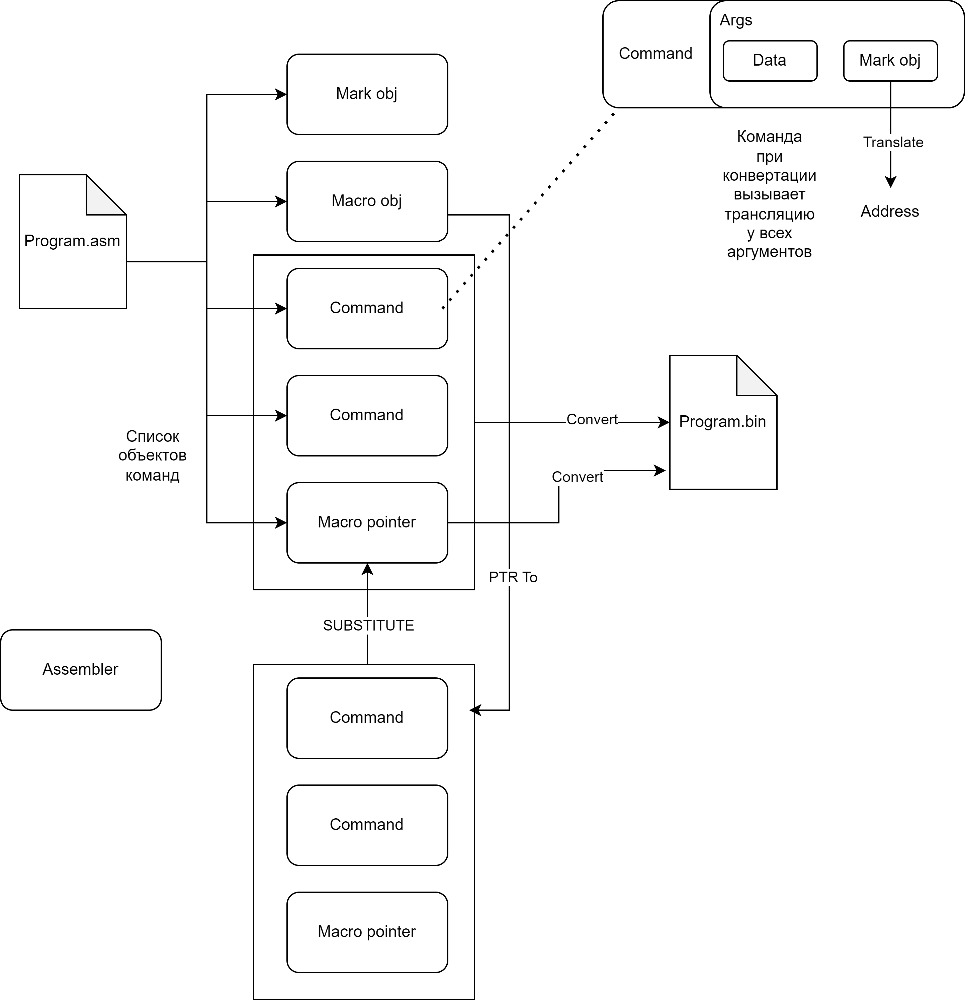
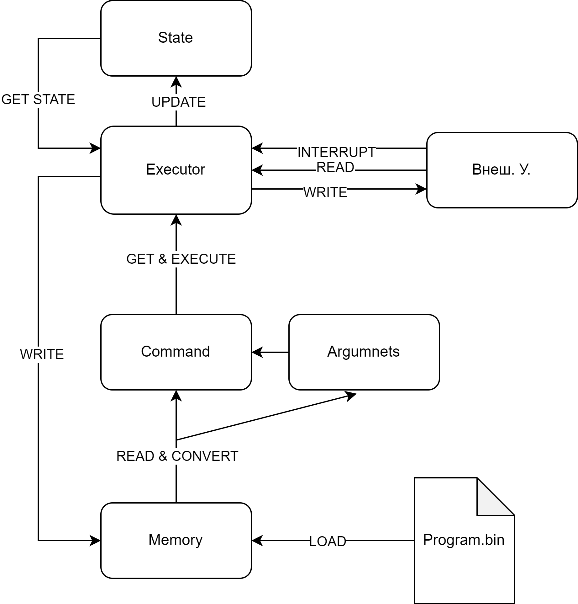

# Карта проекта

### 1. Ассемблер

1. Удалить комменты
2. Вычленить самописные макросы
3. Раскрыть макросы
4. Подсчитать кол-во слов памяти для программы
5. Расставить адреса меток
6. Пишем битики:
    1. Код операции
    2. Операнды (регистр+ режим адресации)
    3. Доп. слова (числа, относительные расстояния и т.п.)

### 2. Дизассемблер

> Возможно не нужен, т.к. можно просто сразу трактовать битики

см. [Классы](#классы)

### 3. Executor

1. Прерывание (если есть и если более приоритетное) (см. [Прерывания](#5-прерывания))
2. Извлечь команду
3. Декодировать
4. Исполнить
5. Повторить, пока не HALT; либо пошаговый режим - остановиться и ждать следующей команды

> Можно потребовать от юзера явно вводить HALT

### 4. Внешние устройства

Создаем SDK. В нашем случае будет достаточно одного интерфейса:

```
interface IDevice:
   int ReadBufferRegisterAddress(); // RRB
   int WriteBufferRegisterAddress();  // RWB
   int ReadControlReagisterAddress();  // RCR
   int WriteControlRegisterAddress();  // RCW
   int InterruptVectorAddress();  // RIA
   bool HasInterrupt();

   void WriteToRWB();
   void ReadFromRRB();
   void WriteToRCR();
   void WriteToRCW();
   void ReadFromRCR();
   void ReadFromRCW();
```

> Возможно, еще интерфейс фабрики IDeviceFactory с обязательной реализацией в виде DeviceFactory, чтобы мы легко символы подтягивали

Другой человек реализует свое устройство, компилит, на выходе DLL.

В нашем симуляторе сделаем в настройках блок ВУ, в которых он сможет эти DLL добавлять.

### 5. Прерывания

Перед извлечением команды проверяем все ВУ на наличие прерывания (см. [Внешние устройства](#4-внешние-устройства)).

Если есть, то проверяем приоритет, и, если более высокий, то обрабатываем.

### 6. GUI

1. Поле ввода текста
2. Кнопки _Создать_, _Открыть_, _Сохранить_, _Сохранить как_, _Закрыть_
3. Кнопка _Настройки_
    1. Управление шрифтом редактора
    2. [Управление ВУ](#61-управление-ву)
4. Кнопка _Справка_
    1. О программе
    2. Список команд
5. Кнопка _Компиляция_
6. Кнопки _Старт_, _Стоп_
7. Кнопка _Шаг_ (пошаговый режим)

#### 6.1. Управление ВУ

Список, в который можно добавлять ВУ:
1. Кнопки _Добавить_, _Удалить_
2. При добавлении открывается всплывающее окно открытия файла (DLL). После открытия валидация, что это корректный файл.

## Классы

```
Memory:
   byte[] Data;
   
   byte GetByte(int address);
   void SetByte(int address, byte value);
```

> Хз, но правильно будет, мб, сделать ее байтовой, а слова вынести на уровень команд и операндов. Хотя удобно будет
> просто вызвать GetWord(addr), вместо двух GetByte(addr) - будем посмотреть

```
Argument:
   Memory Memory;
   int RegisterNumber;
   int AddressationType;
   bool IsByteOperand;
   
   int GetAddress();
   TRes GetValue();
   void SetValue(TVal value);
```

> Мб вместо GetValue/SetValue и типа операнда сделать методы Get/SetByte и Get/SetWord

> Можно еще тогда сделать класс Word - просто обертка над двумя байтами

```
Command:
   Argument[] Arguments;
   
   void Execute();
```

> Мб сделать его абстрактным и сделать много наследников (MovCommand, SumCommand и т.д.), и в конструкторах проверять валидность операндов

> Мб вместо классов просто Callable использовать, в целом все команды ведь уже изветсны, их можно статически прописать

### Классовые диаграммы


